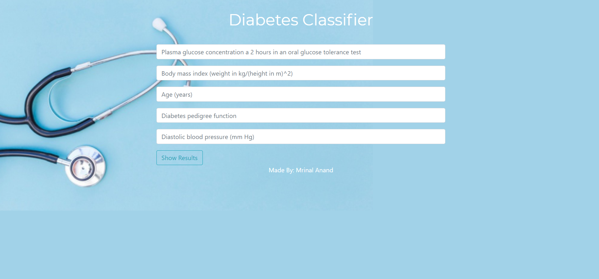
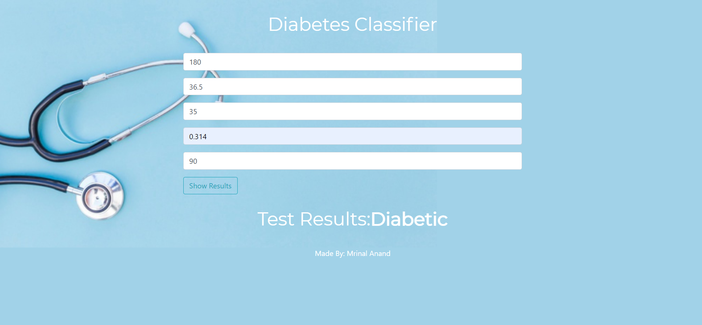
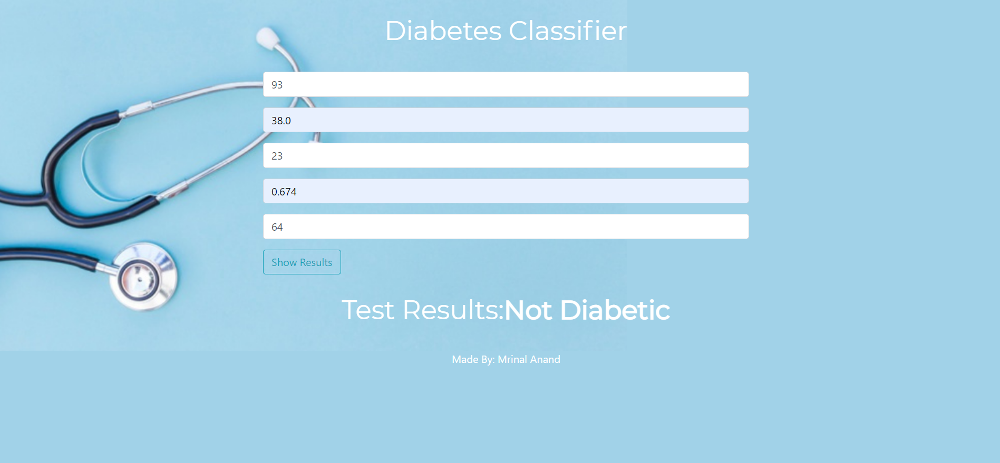

# Diabetes-Classification
Predict if a person is suffering from diabetes using Random Forset classifier.

## Working of code
1. Analysis of Pima Indians Diabetes Dataset which consist of 576 instances and 8 features.
      1. List relevance of all the features using feature importance.
      1. Visualize the feature importance in form of a bar graph.
      1. Select the features which relate most to the output.
1. Train the model on the dataset.
1. Classify the instance as diabetic(1) and non-diabetic(0).
1. Deploy the built model on Flask.

## File-wise explaination
* DiabetesClassification-checkpoint.ipynb : to perform analysis and train the model.
* model.pkl : stores the built model.
* app.py : deploys the model using Flask framework.

## Result Snippets

